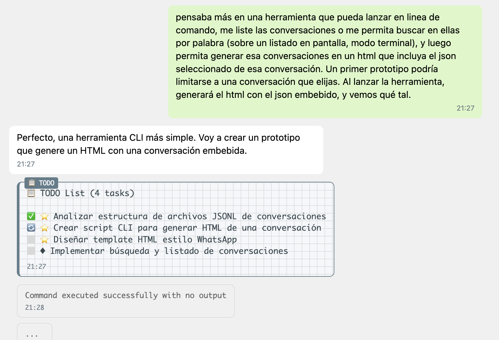
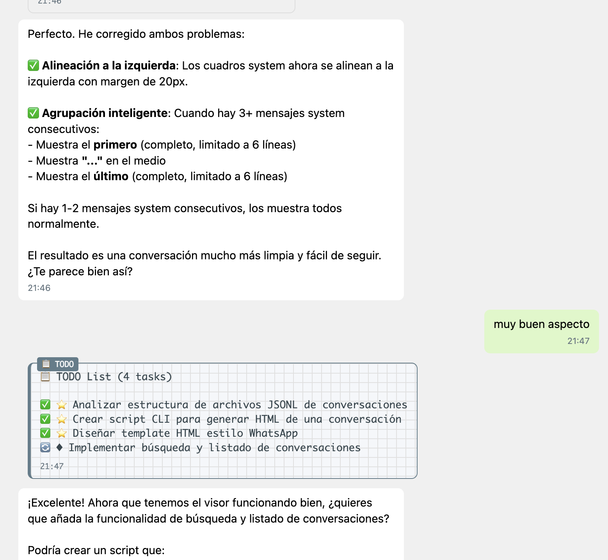

# Claude Chat Viewer

An interactive CLI tool to view and export Claude conversation histories with a beautiful WhatsApp-style HTML visualization.

## Screenshots

<p align="center">
  
  <br><em>Interactive search and filtering of conversations</em>
</p>

<p align="center">
  
  <br><em>Beautiful WhatsApp-style HTML visualization</em>
</p>

## Features

- 🔍 **Interactive Search**: Real-time filtering of conversations by date, project, or content
- 💬 **WhatsApp-style Export**: Beautiful HTML visualization that looks like a chat interface
- 📊 **TODO Tracking**: Special formatting for TODO lists with multiple theme options
- 🎨 **Customizable Themes**: Choose from different notebook-style backgrounds for TODO messages
- ⚡ **Fast & Efficient**: Quickly browse through hundreds of conversations

## Installation

```bash
npm install -g claude-chat-viewer
```

## Usage

### Basic Usage

```bash
claude-chat-viewer
```

This will launch an interactive interface where you can:
- Type to search conversations in real-time
- Use arrow keys to navigate
- Press Enter to select a conversation
- Generate and view HTML exports

### Theme Options

Customize the TODO background theme:

```bash
# Grid pattern (default)
claude-chat-viewer --todo-background=grid

# Lined notebook
claude-chat-viewer --todo-background=lines

# Graph paper
claude-chat-viewer --todo-background=graph

# Dot grid (bullet journal style)
claude-chat-viewer --todo-background=dots

# Clean (no background)
claude-chat-viewer --todo-background=clean
```

### Search Tips

The search feature filters by:
- **Date/Time**: Search for "27/5" or "14:30"
- **Project Name**: Search for project folder names
- **Content**: Search within the first user prompt
- **Session ID**: Direct access with session UUID

## Requirements

- Node.js 14.0.0 or higher
- Claude conversations stored in `~/.claude/projects/`

## How It Works

Claude Chat Viewer reads the JSONL conversation files stored by Claude in your home directory and provides an intuitive interface to browse and export them. Each conversation is parsed to extract:

- Start and end times
- Message count
- Project context
- First user prompt
- TODO lists and their progression

The HTML export includes:
- Formatted messages with markdown support
- Code blocks with syntax highlighting
- System messages in a subtle style
- TODO lists with visual indicators
- Timestamps and date separators

## Development

```bash
# Clone the repository
git clone https://github.com/jorgeuriarte/claude-chat-viewer.git
cd claude-chat-viewer

# Install dependencies
npm install

# Run locally
node bin/claude-chat-viewer.js
```

## License

MIT

## Contributing

Contributions are welcome! Please feel free to submit a Pull Request.

## Author

Jorge

## Acknowledgments

Built for the Claude community to better visualize and archive their AI conversations.